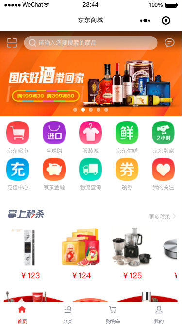
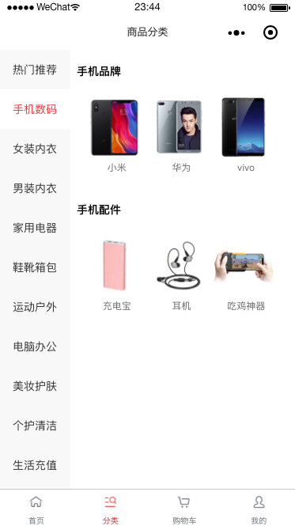
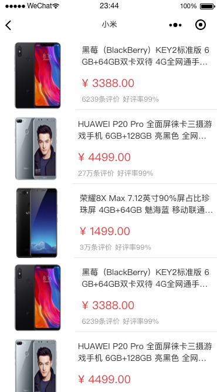
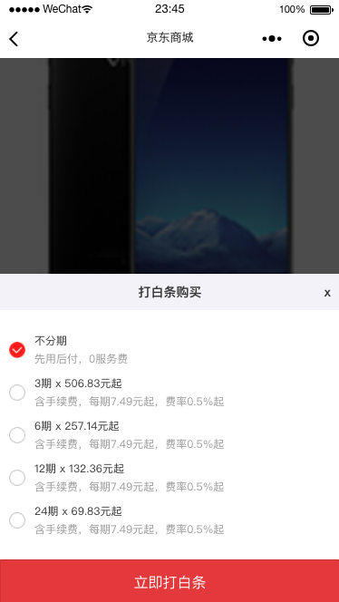
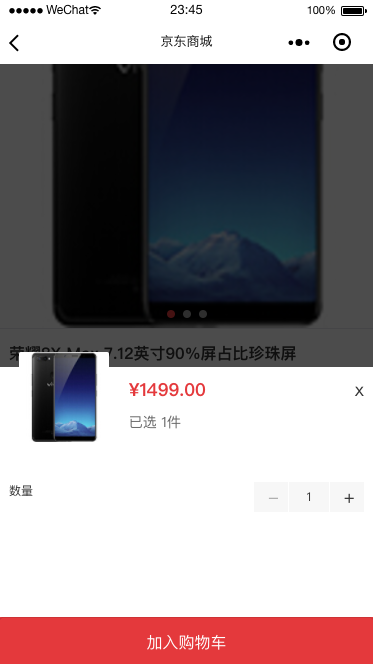
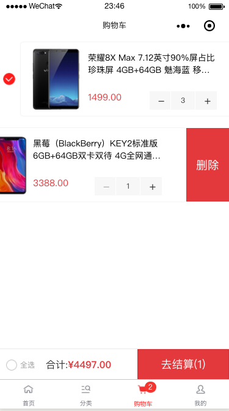

# JD Shopping WeChar Applicaions

## 高效还原京东商城微信小程序

> 注： server是服务端源码 可自行下载部署


> UI











> files

```
.
├── README.md
├── app.js
├── app.json
├── app.wxss
├── components 						// 组件
│   ├── IOU							// 白条组件
│   │   ├── iouCom.js
│   │   ├── iouCom.json
│   │   ├── iouCom.wxml
│   │   └── iouCom.wxss
│   ├── count						// 计数器组件
│   │   ├── count.js
│   │   ├── count.json
│   │   ├── count.wxml
│   │   └── count.wxss
│   ├── detailsComponent			// 商品详情组件
│   │   ├── detailsCom.js
│   │   ├── detailsCom.json
│   │   ├── detailsCom.wxml
│   │   └── detailsCom.wxss
│   └── selectedNum					// 选择类型组件
│       ├── selectedNum.js
│       ├── selectedNum.json
│       ├── selectedNum.wxml
│       └── selectedNum.wxss
├── image
├── pages
│   ├── cart						// 购物车
│   │   ├── cart.js
│   │   ├── cart.json
│   │   ├── cart.wxml
│   │   └── cart.wxss
│   ├── class						// 分类
│   │   ├── class.js
│   │   ├── class.json
│   │   ├── class.wxml
│   │   └── class.wxss
│   ├── home						// 首页
│   │   ├── home.js
│   │   ├── home.json
│   │   ├── home.wxml
│   │   └── home.wxss
│   ├── image
│   ├── logs						// 日志文件
│   │   ├── logs.js
│   │   ├── logs.json
│   │   ├── logs.wxml
│   │   └── logs.wxss
│   ├── my							// 我的				
│   │   ├── my.js
│   │   ├── my.json
│   │   ├── my.wxml
│   │   └── my.wxss
│   ├── productdetail				// 商品品详情页
│   │   ├── productdetail.js
│   │   ├── productdetail.json
│   │   ├── productdetail.wxml
│   │   └── productdetail.wxss
│   └── productlist					// 商品列表页
│       ├── productlist.js
│       ├── productlist.json
│       ├── productlist.wxml
│       └── productlist.wxss
├── project.config.json
└── utils
    ├── common.js 					// js 公共方法
    └── util.js

18 directories, 177 files

```

Copy right displayli 转载请加备注 或 联系 QQ：463961434

Author By displayLi @ [LINK+ 创意工作室 ](http://www.link97.com "LINK Create Studio")
